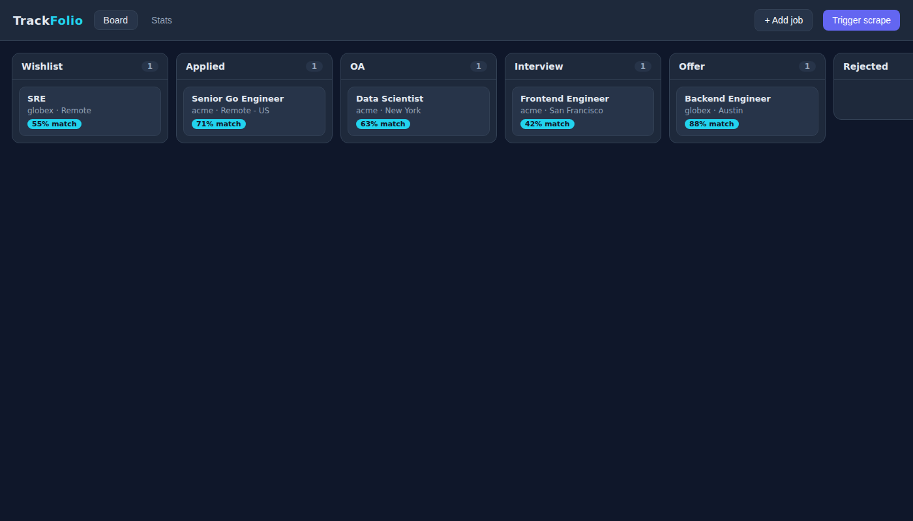
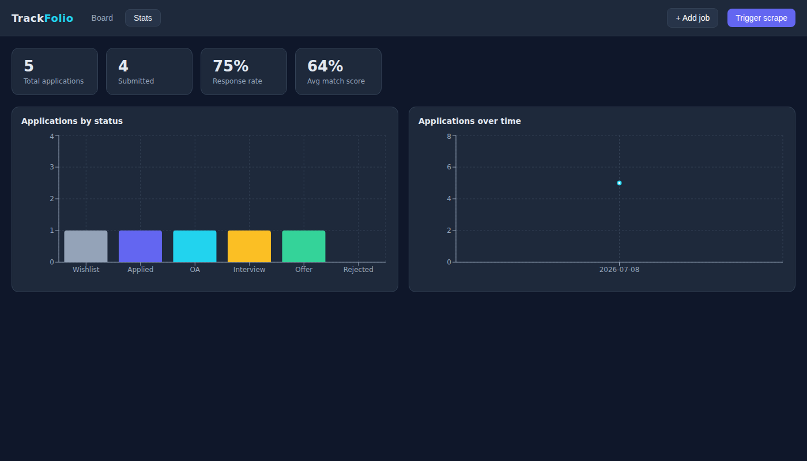

# TrackFolio — Job Application Pipeline Platform

A self-hosted platform that scrapes job postings, scores them against a resume,
tracks applications through a pipeline, and visualizes progress on a dashboard.
Built as **4 independently deployable microservices** over PostgreSQL, MongoDB,
and Redis — a coherent system, not disconnected snippets — to demonstrate Go,
Python, Node/TypeScript, React, Docker, and Kubernetes together.




> The screenshots above are the real app running against the full local stack
> (Go scraper + Node gateway + Python match service + Postgres/Redis).

## Services

| # | Service | Stack | Responsibility |
|---|---|---|---|
| 1 | [`scraper-go`](services/scraper-go) | Go | Fetch postings from Greenhouse/Lever JSON APIs with a goroutine worker pool; dedup via Redis; write structured fields to Postgres and raw JD to Mongo. |
| 2 | [`match-service-py`](services/match-service-py) | Python / FastAPI | Score a resume against a JD (TF-IDF + cosine) and return matched/missing skill keywords. |
| 3 | [`api-gateway-node`](services/api-gateway-node) | Node / TypeScript / Express | Own the application data model; CRUD + dashboard aggregates; proxy to the scraper and match service. |
| 4 | [`frontend-react`](services/frontend-react) | React / TypeScript / Vite | Kanban board (drag-and-drop status), detail modal with match analysis, dashboard charts. |

See [`docs/ARCHITECTURE.md`](docs/ARCHITECTURE.md) for the data-flow and the
rationale behind each language and datastore, and [`docs/API.md`](docs/API.md)
for the endpoint reference.

## Quick start (docker-compose)

Brings up all 7 containers (4 services + Postgres + Mongo + Redis). The Postgres
schema is applied automatically on first boot.

```bash
docker compose -f infra/docker-compose.yml up --build
# then open:
open http://localhost:5173          # dashboard
curl localhost:8080/health          # gateway
curl -X POST localhost:8080/api/jobs/scrape-trigger   # kick a scrape
```

Ports: frontend `5173`, gateway `8080`, scraper `8081`, match `8082`,
Postgres `5432` (via the dev override), Mongo `27017`, Redis `6379`.

### Running services locally against dockerized databases

```bash
docker compose -f infra/docker-compose.yml -f infra/docker-compose.dev.yml \
  up postgres mongo redis                 # just the datastores, ports published
psql "$DATABASE_URL" -f db/schema.sql      # apply schema

# each service (separate shells):
cd services/scraper-go        && go run .
cd services/match-service-py  && pip install -r requirements.txt && uvicorn app.main:app --port 8082
cd services/api-gateway-node  && npm install && npm run dev
cd services/frontend-react    && npm install && npm run dev
```

Copy each service's `.env.example` to `.env` and adjust as needed.

## Kubernetes (minikube)

```bash
minikube start --cpus 4 --memory 6g
minikube addons enable metrics-server        # required for the scraper HPA
minikube addons enable ingress

# build images into minikube's docker daemon (no registry needed):
eval $(minikube docker-env)
docker build -t trackfolio/scraper:latest      services/scraper-go
docker build -t trackfolio/match-service:latest services/match-service-py
docker build -t trackfolio/api-gateway:latest   services/api-gateway-node
docker build -t trackfolio/frontend:latest      services/frontend-react

# secrets: copy the example and fill in real values (real file is gitignored)
cp infra/k8s/secrets.yaml.example infra/k8s/secrets.yaml   # edit passwords
kubectl apply -f infra/k8s/secrets.yaml

kubectl apply -f infra/k8s/          # namespace, config, DBs, services, ingress, HPA

# reach it:
echo "$(minikube ip) trackfolio.local" | sudo tee -a /etc/hosts
open http://trackfolio.local
# watch autoscaling:
kubectl -n trackfolio get hpa scraper -w
```

Postgres/Mongo/Redis run as StatefulSets with PVCs; each app service is a
Deployment + Service with liveness/readiness probes on `/health`. The scraper
has a HorizontalPodAutoscaler (CPU 60%, min 1 / max 5).

## Testing & verification

Everything below was run and verified during development:

- **Scraper (Go):** `go test ./...` — httptest unit tests for the Greenhouse and
  Lever fetchers + HTML stripping. Full pipeline verified end-to-end against a
  local Postgres + Redis with a fixture job board (5-job and 500-job).
- **Match (Python):** `pytest` — 8 tests covering bounded scores,
  similar > dissimilar ordering, keyword-gap logic, and edge cases. Live
  `/score` and `/health` exercised via the running service.
- **Gateway (Node):** `npm run typecheck` + `npm run build`. Every endpoint
  exercised end-to-end against Postgres with the scraper and match service wired
  in (CRUD, status transitions, proxies, dashboard, 400/404/409 paths).
- **Frontend (React):** `npm run build` (tsc + vite). Rendered in a real
  headless browser against the live gateway — board, detail modal, and both
  charts confirmed.
- **Load test:** see [`docs/LOAD_TEST_RESULTS.md`](docs/LOAD_TEST_RESULTS.md) for
  measured throughput/latency and the worker-pool scaling analysis.

## Performance (measured)

Real figures from `docs/LOAD_TEST_RESULTS.md` (4-core build box, local single-node
Postgres/Redis, Mongo disabled to isolate the Postgres path):

- `GET /health` ≈ **38,000 req/s**; `GET /metrics` ≈ **24,000 req/s**.
- Pipeline throughput rises **456 → 730 jobs/sec** as workers go 1 → 5, then
  plateaus — a single Postgres instance becomes the bottleneck past ~5 workers.
- 200 concurrent `POST /trigger` → exactly **1 accepted, 199 × 409** (single-flight).

No throughput number is claimed for anything that wasn't run — see the
limitations below.

## Known limitations / not implemented

This section is deliberate: these are honest scope cuts, not hidden gaps.

- **IMAP email status parsing — NOT implemented.** Listed as a stretch goal in
  the spec. It was cut rather than shipped as a stub: it needs a live IMAP inbox
  to be genuinely functional, and an unverifiable stub would be worse than an
  honest omission. The `status_events.source` column already supports an
  `'email_parsed'` value for when it is added.
- **No authentication.** MVP is single-user / personal, local use — an explicit
  scope cut, not an oversight. Would need auth before any multi-user deployment.
- **HPA pod autoscaling was not measured** in the build environment (no
  Kubernetes cluster / metrics-server available there). The manifest is written
  and the reproduction steps are documented, but no scaling numbers are claimed.
- **Live scraping targets are configurable but were exercised against a local
  fixture** in the build environment (outbound access to public job boards was
  restricted there). The fetchers target the real Greenhouse
  (`boards-api.greenhouse.io`) and Lever (`api.lever.co`) JSON APIs; point
  `SCRAPER_SOURCES` at real board slugs (e.g. `greenhouse:stripe`) in an
  environment with internet egress.
- **Mongo integration** is coded against the official driver and wired in compose
  and k8s, but the Mongo write path was not run in the build environment (no
  local mongod); the scraper degrades gracefully to Postgres-only when Mongo is
  absent.
- **Fetchers cover Greenhouse and Lever only.** If a board changes ATS entirely
  the fetcher returns an error (logged, counted in `/metrics.errors`) and the
  run continues for other sources; adding a source is a new `Fetcher`
  implementation.

## Repository layout

```
services/         scraper-go, match-service-py, api-gateway-node, frontend-react
db/schema.sql     PostgreSQL schema
infra/            docker-compose(.dev).yml, k8s/ manifests
docs/             ARCHITECTURE.md, API.md, LOAD_TEST_RESULTS.md, images/
```
